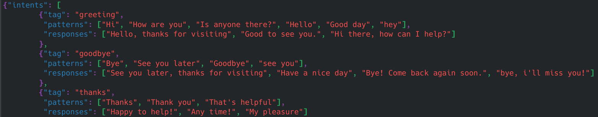
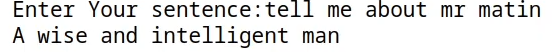
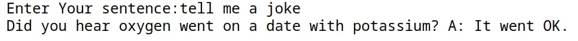

### ChatBot in python with Pytorch.

Implementation of a simple intent base chatbot in python with pytorch framework.

Dependencies:

- python +3.7
- pytorch
	
In this simple model first we prepare a dataset base on intents with answer:

Then train a simple sentence classifier with recurrent neural networks or standard feed forward neural network.

After the training we have an model which is capable of predicting peaople intents, base on this model the program answer to the questions by choosing random answer from predefined answers related to predicted topic.

An example of the output is as follow:

---

